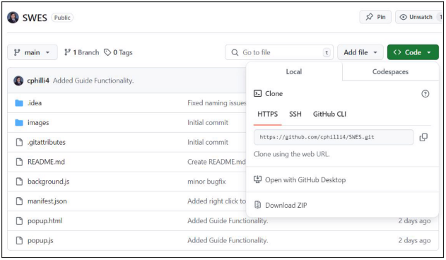
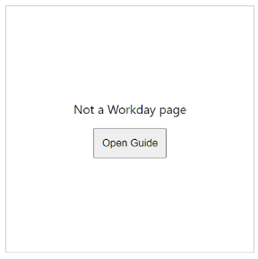
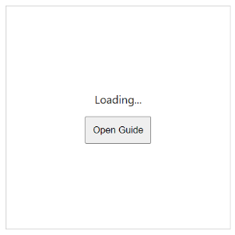

# **SWES User Guide**

The Stevens Workday Easy Signup (SWES) is a Google Chrome Plugin designed to assist in the schedule creation process.

## Plugin Setup

After downloading and unpacking the plugin’s ZIP from [Github](https://github.com/cphilli4/SWES), you must add your own functioning OpenAI API key to line 3 of the background.js file

After this is completed and the file is saved, go to the Google Chrome browser extension page by entering chrome://extensions into the address bar. Here select the ‘Load unpacked’ button and select the plugin folder. This will automatically add SWES to your extensions bar.

## Plugin Usage

When the plugin icon in the extension bar is clicked, it will open a popup and attempt to simplify any Workday course requirements on the currently open Chrome tab. If the requirements have already been simplified, no popup will appear. There is also a button to open this guide in a new chrome tab. If an issue occurs in the simplification process, a message will appear in the popup window. See below for specific messages and their meanings.

This message appears if the extension is used on a website other than myworkday.com. Try navigating to a Workday page to get a different message.

If the myworkday.com webpage you are on is not a course page with an ‘Eligibility’ section, this message will appear. Try navigating to a course page to get a different message.

This message appears when the plugin has placed a call to the OpenAI API. If it does not disappear after a few seconds, there may be an issue with the API key added to background.js. Check that it is correct and then remove and re-add the plugin using the same process as before. If this does not work, check if there is an outage of the OpenAI servers.
